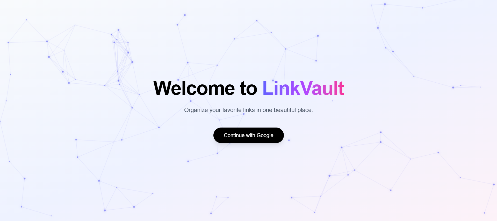
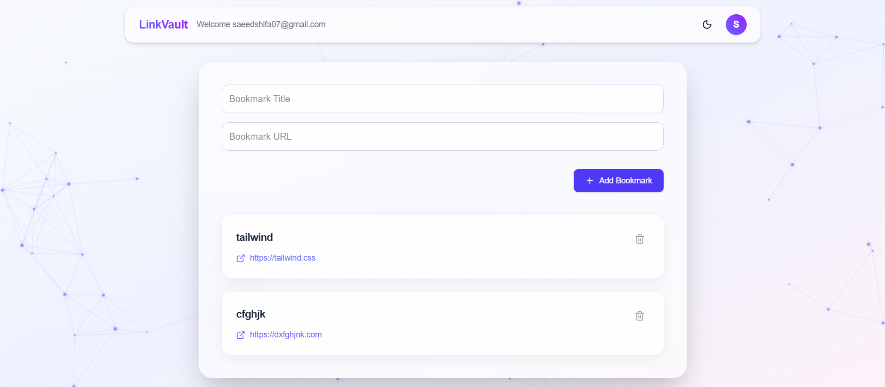

# 🔗 LinkVault

LinkVault is a modern, real-time bookmark manager built with Next.js and Supabase.

It allows users to securely store and manage bookmarks with instant real-time updates across multiple tabs.

🌍 Live Demo: https://your-vercel-url.vercel.app

---

## ✨ Features

- 🔐 Google OAuth Authentication (Supabase Auth)
- ⚡ Real-time bookmark sync across tabs
- 🌗 Persistent Dark / Light theme
- ✨ Animated particle background
- 💎 Glassmorphic UI with smooth animations
- 🚀 Optimistic UI updates
- 🧠 URL normalization and validation
- 📱 Fully responsive design

---

## 🛠 Tech Stack

- Next.js (App Router)
- TypeScript
- Supabase (Auth + Database + Realtime)
- Tailwind CSS
- Framer Motion
- Lucide React
- Sonner (Toast notifications)

---

## 🧠 Architecture & Implementation Details

### 🔐 Authentication & User Privacy

- Google OAuth implemented using Supabase Auth
- Session validation performed on dashboard load
- Protected routes redirect unauthenticated users
- Row Level Security (RLS) enabled
- Each bookmark is scoped by `user_id`
- Users can only access their own bookmarks

---

### ⚡ Real-Time Updates

Real-time functionality is implemented using Supabase Realtime:

- Subscribed to `postgres_changes`
- Filtered events by authenticated user ID
- Insert and delete operations trigger instant UI updates
- Enabled `REPLICA IDENTITY FULL` to support delete events

This ensures live synchronization across multiple tabs.

---

### 🎨 UI & Experience

- Custom animated particle background
- Glassmorphic card design
- Smooth hover and modal animations
- Dark mode persistence using localStorage
- Optimistic UI updates for instant feedback

---

## 🚀 Getting Started

### 1️⃣ Clone the Repository

```bash
git clone https://github.com/yourusername/linkvault.git
cd linkvault
```

### 2️⃣ Install Dependencies

```bash
npm install
```

### 3️⃣ Configure Environment Variables

Create a `.env.local` file in the root directory:

```env
NEXT_PUBLIC_SUPABASE_URL=your_project_url
NEXT_PUBLIC_SUPABASE_ANON_KEY=your_anon_key
```

### 4️⃣ Supabase Setup

Enable Google OAuth in **Authentication → Providers**.

Add redirect URL:

```
http://localhost:3000/auth/callback
```

For production:

```
https://your-vercel-url.vercel.app/auth/callback
```

Create the `bookmarks` table and enable Row Level Security (RLS).

Enable realtime replication and run:

```sql
ALTER TABLE bookmarks REPLICA IDENTITY FULL;
```

### 5️⃣ Run Development Server

```bash
npm run dev
```

Open in browser:

```
http://localhost:3000
```

---

## 📂 Project Structure

```
.
├── app
│   ├── layout.tsx
│   ├── page.tsx
│   ├── dashboard
│   │   ├── layout.tsx
│   │   └── page.tsx
│   └── auth
│       └── callback
│           └── page.tsx
│
├── components
│   ├── BookmarkForm.tsx
│   ├── BookmarkList.tsx
│   ├── Navbar.tsx
│   └── ParticleBackground.tsx
│
├── lib
│   └── supabase-client.ts
│
├── public
│   └── favicon.svg
│
├── next.config.ts
├── package.json
├── README.md
├── tsconfig.json
└── .env.local (not committed)
```

---

## 🧩 Challenges Faced & Solutions

### 1️⃣ OAuth Redirect Hash Issue

**Problem:**  
After Google OAuth login, users were occasionally redirected to `/dashboard#`.

**Solution:**  
Implemented a dedicated `/auth/callback` route to properly resolve the session before redirecting cleanly to `/dashboard`.

---

### 2️⃣ Real-Time Delete Events Not Syncing

**Problem:**  
Delete operations were not syncing across tabs.

**Root Cause:**  
PostgreSQL requires full row identity for delete event propagation.

**Solution:**

```sql
ALTER TABLE bookmarks REPLICA IDENTITY FULL;
```


**Problem:**  
Insert events were syncing correctly across tabs, but delete operations were not triggering realtime updates.

**Root Cause:**  
PostgreSQL requires full row identity for delete event propagation in logical replication.

**Solution:**  
Enabled full replica identity for the `bookmarks` table:

```sql
ALTER TABLE bookmarks REPLICA IDENTITY FULL;
```

## 📸 Screenshots

### 🔐 Login Experience



### 📊 Dashboard View



